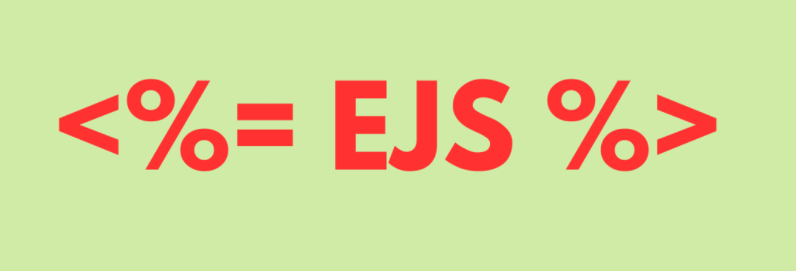

## TradeTrail

<p align="center">
    
</p>

<p style="text-align: center; font-size: 32px; font-weight: bold;">
    SWAP, SELL, RENT, REPEAT!
</p>

   
</button>
</a>

## Introduction

DESIS Ascend Educare project by Juniher Group-3 2024-2025

## Description

TradeTrail is a platform built around the **circular economy**, enabling users to:

- **Rent** and **buy secondhand items**.
- **Access OTT platforms** for entertainment.
- **Bid on items**, with support for both **monetary bids** and **product-based bids**.

This project fosters sustainability by promoting reuse and smart trading while integrating a dynamic marketplace.

## Features

📦 Rent & Buy secondhand items easily.

🎥 OTT Integration to explore entertainment options.

🔄 Bidding System supporting both monetary and product-based exchanges.

💳 Secure Payments & Refunds via Razorpay integration.

🚀 User-Friendly Interface for seamless transactions.

🔑 Signup using Google or Facebook accounts.

🔄 Password Reset & Update in case of forgotten credentials.

🏠 Renting Options available on an hourly, weekly, or monthly basis.

💰 Auction System with both monetary and product-based bids.

🆔 Transaction ID & Refund Details displayed after every payment.

🔐 OTP Verification before every transaction for security.

🤖 Chatbot System to reduce workload and enhance user support.

📜 Order History available in user profiles.

🛒 Separate Carts for rental, secondhand, and subscription-based items.

## Installation

To deploy this project run

### 1. Clone the repository using:

```bash
  https://github.com/wsLord/TradeTrail
```

### 2. Install Ollama

For mac:

i) Open Terminal

ii) Run:

```bash
   brew install Ollama
```

iii) Start Ollama Service:

```bash
   Ollama serve
```

(keep this terminal running)

### 3. Run the following

```bash
   npm install
```

### 4.Pull a model (only needed once). In a new terminal window, run:

```bash
   Ollama pull mistral
```

### 5. Start MongoDB and set up following ENV files:

```bash
MONGO_DB_URI
JWT_SECRET
RAZORPAY_KEY_ID
RAZORPAY_KEY_SECRET
CLOUDINARY_CLOUD_NAME
CLOUDINARY_API_KEY
CLOUDINARY_API_SECRET
GOOGLE_CLIENT_ID
GOOGLE_CLIENT_SECRET
GOOGLE_REDIRECT_URI
BASE_URL
FACEBOOK_APP_ID
FACEBOOK_APP_SECRET
FACEBOOK_REDIRECT_URI
EMAIL_SERVICE
EMAIL_USER
EMAIL_PASSWORD
NODE_ENV
PORT

```

### 6. Run the following command

```bash
   npm start
```

## Tech-Stack Used

- **NodeJS** (ExpressJS)
- **EJS**
- **CSS**
- **Bootstrap**
- **JavaScript**
- **MongoDB** (as Database)
- **Ollama AI**

## 🔗 Contributors

- **Aarya Kotalwar** - [GitHub](https://github.com/Aaryakotalwar)
- **Anjali Tiwari** - [GitHub](https://github.com/Anjali-2807)
- **Leshya Jain** - [GitHub](https://github.com/Leshya09)
- **Nikki Gautam** - [GitHub](https://github.com/nix-per)

## Mentor

**Priyanshu Gupta** - [Github](https://github.com/wsLord)

## Feedback

Let us know if you need any modifications! 🚀
